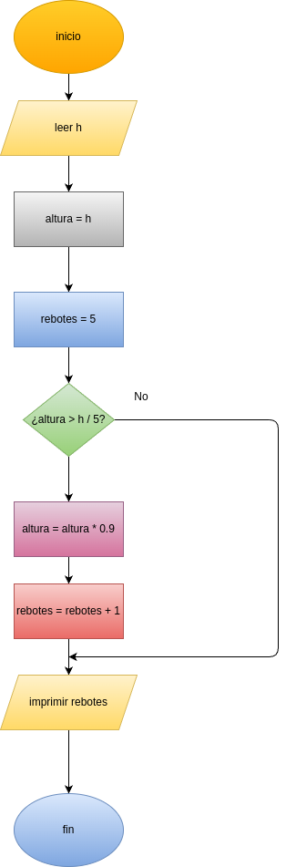

# rebote_pelota

Programa en Python que calcula en qué rebote una pelota deja de alcanzar
la quinta parte de su altura inicial.

## Descripción

Una pelota se deja caer desde una altura `h`.  
En cada rebote la pelota alcanza una altura **10% menor que la anterior**.

El programa calcula **en qué rebote la pelota deja de alcanzar la quinta parte
de la altura inicial**.

Para resolver el problema se utiliza un **ciclo while**, que repite el cálculo
hasta que la altura del rebote sea menor que `h / 5`.

## Diseño



## Algoritmo

1. Leer la altura inicial `h`.
2. Guardar la altura actual.
3. Inicializar el contador de rebotes.
4. Mientras la altura sea mayor o igual a `h/5`:
   - Calcular la nueva altura (`altura * 0.9`).
   - Aumentar el contador de rebotes.
5. Mostrar el número de rebotes.

## Código

```python
# ---------------------------------
# Programa: Rebote de una pelota
# ---------------------------------

# -----------------
# input
# -----------------
h = float(input("Ingrese la altura inicial de la pelota: "))

# -----------------
# processing
# -----------------
altura = h
rebotes = 0

while altura >= h/5:
    altura = altura * 0.9
    rebotes = rebotes + 1

# -----------------
# output
# -----------------
print("La pelota deja de alcanzar la quinta parte de la altura inicial en el rebote:", rebotes)
```

## Ejemplo de ejecución

```
Ingrese la altura inicial de la pelota: 10
La pelota deja de alcanzar la quinta parte de la altura inicial en el rebote: 16
```

## Tecnologías utilizadas

- Python
- Ciclo `while`
- Operaciones matemáticas